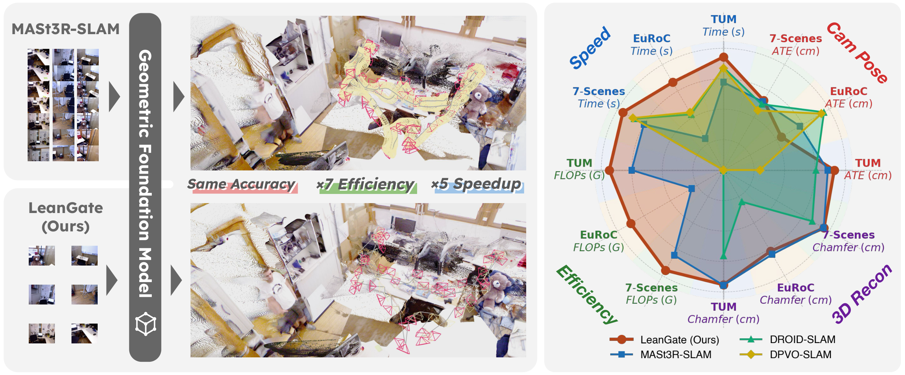
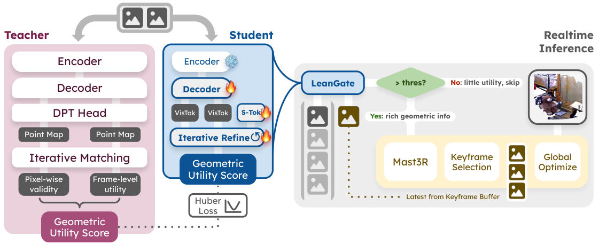
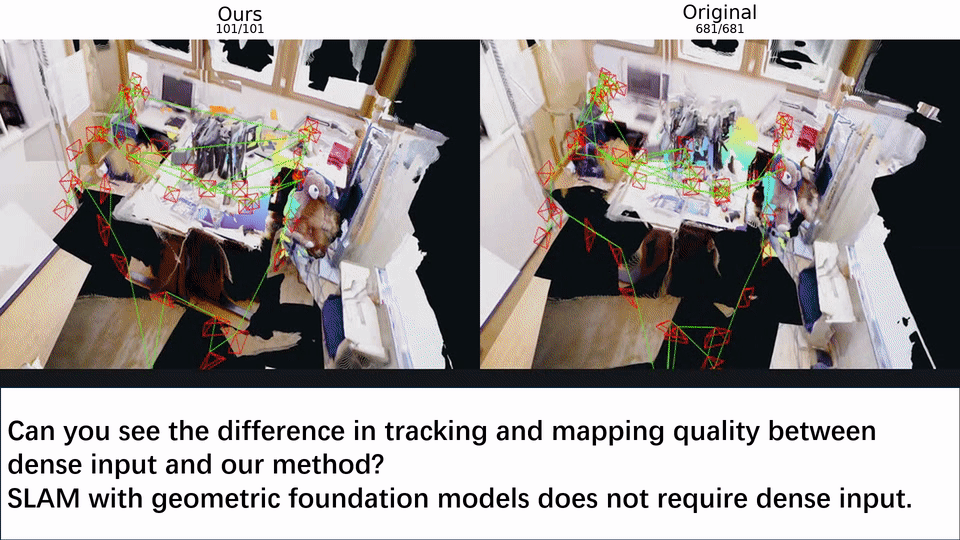

# LeanGate code release

<div align="center">
  <p>
    <a href="https://arxiv.org/search/cs?searchtype=author&query=Xiong%2C+X">Xinmiao Xiong</a><sup>1*</sup>,
    <a href="https://arxiv.org/search/cs?searchtype=author&query=Liu%2C+B">Bangya Liu</a><sup>1*</sup>,
    <a href="https://arxiv.org/search/cs?searchtype=author&query=Wang%2C+H">Hao Wang</a><sup>2</sup>,
    <a href="https://arxiv.org/search/cs?searchtype=author&query=Li%2C+D">Dayou Li</a><sup>2</sup>,
    <a href="https://arxiv.org/search/cs?searchtype=author&query=Chen%2C+N">Nuo Chen</a><sup>2</sup>,
    <br>
    <a href="https://arxiv.org/search/cs?searchtype=author&query=Feng%2C+A">Andrew Feng</a><sup>3</sup>,
    <a href="https://arxiv.org/search/cs?searchtype=author&query=Ding%2C+M">Mingyu Ding</a><sup>4</sup>,
    <a href="https://arxiv.org/search/cs?searchtype=author&query=Banerjee%2C+S">Suman Banerjee</a><sup>1</sup>,
    <a href="https://arxiv.org/search/cs?searchtype=author&query=Zhou%2C+Y">Yang Zhou</a><sup>2</sup>,
    <a href="https://arxiv.org/search/cs?searchtype=author&query=Fan%2C+Z">Zhiwen Fan</a><sup>2&dagger;</sup>
    <br>
    <sup>1</sup>UW&ndash;Madison &nbsp;&nbsp;
    <sup>2</sup>Texas A&amp;M &nbsp;&nbsp;
    <sup>3</sup>USC &nbsp;&nbsp;
    <sup>4</sup>UNC Chapel Hill
    <br>
    <sup>*</sup>Equal contribution. &nbsp;&nbsp;
    <sup>&dagger;</sup>Corresponding author: zhiwenfan@tamu.edu.
  </p>
  <p>
    <a href="https://arxiv.org/abs/2604.08718"></a> &nbsp;&nbsp;&nbsp;&nbsp;
    <a href="https://lean-gate.github.io/"></a> &nbsp;&nbsp;&nbsp;&nbsp;
    <a href="https://huggingface.co/ShawnX98/LeanGate/resolve/main/leangate.pt"></a> &nbsp;&nbsp;&nbsp;&nbsp;
    <a href="./LICENSE"></a>
  </p>
</div>

## Overview
<p align="center">
  
</p>

LeanGate is a framework for accelerating transformer-based monocular SLAM via geometric utility scoring. It bypasses over 90% of input frames in dense streaming while preserving the fidelity of mapping, tracking, and camera pose estimation.

### Key Contributions
- We identify late rejection as the main bottleneck in GFM-based monocular SLAM, where dense streams spend most compute on temporally redundant frames.
- We introduce a pairwise geometric utility score and a lightweight feed-forward gating network that predicts frame value before expensive geometric decoding.
- We show across multiple SLAM benchmarks that LeanGate improves end-to-end throughput by 5x and reduces tracking FLOPs by over 85% without compromising tracking accuracy.

### System Pipeline
<p align="center">
  
</p>

## Release Scope
This repository exposes the inference path of LeanGate.

1. download the released LeanGate checkpoint,
2. run LeanGate on prepared `TUM`, `7SCENES`, or `EUROC` scenes,
3. export a sparse RGB manifest,
4. optionally run MASt3R-SLAM on that sparse sequence.

## Clone
`third_party/FLARE` and `third_party/MASt3R-SLAM` are Git submodules. Clone the
repo with submodules, or initialize them before installing:

```bash
git clone --recurse-submodules <repo-url>
cd slam_public

# If you already cloned without submodules:
git submodule update --init --recursive
```

## Contents
- [LeanGate code release](#leangate-code-release)
  - [Overview](#overview)
    - [Key Contributions](#key-contributions)
    - [System Pipeline](#system-pipeline)
  - [Release Scope](#release-scope)
  - [Clone](#clone)
  - [Contents](#contents)
  - [Quick Start](#quick-start)
  - [What The User Gets](#what-the-user-gets)
  - [Supported Inputs](#supported-inputs)
  - [Public Workflow](#public-workflow)
    - [1. Install](#1-install)
    - [2. Prepare checkpoints](#2-prepare-checkpoints)
    - [3. Generate sparse RGB manifests](#3-generate-sparse-rgb-manifests)
    - [4. Launch MASt3R-SLAM on the sparse sequence](#4-launch-mast3r-slam-on-the-sparse-sequence)
  - [Outputs](#outputs)
  - [Demo](#demo)
  - [Troubleshooting](#troubleshooting)
  - [Third-party components](#third-party-components)
  - [Repository Layout](#repository-layout)

## Quick Start
```bash
pip install -r requirements-public.txt
pip install -e .
pip install -e third_party/MASt3R-SLAM/thirdparty/mast3r
pip install -e third_party/MASt3R-SLAM/thirdparty/in3d
pip install --no-build-isolation -e third_party/MASt3R-SLAM

python3 scripts/download_checkpoints.py --output-root checkpoints

python3 scripts/generate_rgb_lists.py \
  --dataset-type TUM \
  --dataset-root /data/tum \
  --output-root outputs/predictions \
  --device cuda:0

./demo.sh --folder /data/my_rgb_frames --device cuda:0
```

## What The User Gets
- A checkpoint download entrypoint: `scripts/download_checkpoints.py`
- A sparse RGB export entrypoint: `scripts/generate_rgb_lists.py`
- A plain-RGB-folder demo wrapper: `demo.sh`
- A single-scene MASt3R-SLAM wrapper: `scripts/run_slam_scene.py`
- A dataset-level MASt3R-SLAM wrapper: `scripts/run_slam_dataset.py`

The intended public workflow is:

```text
prepared scene directories
    -> LeanGate inference
    -> sparse rgb manifest
    -> staged sparse scene for MASt3R-SLAM
    -> trajectory / reconstruction outputs
```

## Supported Inputs
- `TUM`
- `7SCENES`
- `EUROC`

The benchmark CLIs support only prepared layouts. The exact expected structures are documented in [docs/dataset_layouts.md](docs/dataset_layouts.md). For a plain image directory, use `demo.sh --folder ...`.

## Public Workflow
### 1. Install
Use `python3` and install PyTorch, `torchvision`, and `pytorch3d` matching your
CUDA/runtime first. Then install the remaining public runtime dependencies and
the local packages:

```bash
pip install -r requirements-public.txt
pip install -e .
pip install -e third_party/MASt3R-SLAM/thirdparty/mast3r
pip install -e third_party/MASt3R-SLAM/thirdparty/in3d
pip install --no-build-isolation -e third_party/MASt3R-SLAM
```

If the submodules are missing, run:

```bash
git submodule update --init --recursive
```

### 2. Prepare checkpoints
The public LeanGate checkpoint is hosted at:

- Repo: `ShawnX98/LeanGate`
- URL: `https://huggingface.co/ShawnX98/LeanGate`
- File: `https://huggingface.co/ShawnX98/LeanGate/resolve/main/leangate.pt`

Download it with:

```bash
python3 scripts/download_checkpoints.py --output-root checkpoints
```

Checkpoint notes:
- The public LeanGate file is expected locally as `checkpoints/leangate.pt`.
- `scripts/generate_rgb_lists.py` uses `leangate.pt` directly as the initialization source; the released setup does not require separate `iter` or `dec` flags.
- LeanGate uses FLARE pretrain weights, which follow FLARE's upstream terms.
- MASt3R-SLAM code and any weights used with it follow MASt3R-SLAM's upstream terms.

### 3. Generate sparse RGB manifests
```bash
python3 scripts/generate_rgb_lists.py \
  --dataset-type TUM \
  --dataset-root /data/tum \
  --output-root outputs/predictions \
  --device cuda:0
```

Each scene produces a manifest containing the kept RGB frames in original scene-relative paths and timestamp order.
By default the public CLI runs LeanGate on a temporally subsampled input
sequence with `--input-subsample 2`. Pass `--input-subsample 1` if you want to
score the full prepared sequence.

For a plain RGB folder demo without dataset manifests:

```bash
./demo.sh \
  --folder /data/my_rgb_frames \
  --output-root outputs/demo \
  --device cuda:0
```

This processes images in sorted filename order and writes the filtered list to `outputs/demo/leangate/<folder_name>.txt`.
The demo wrapper also defaults to `--input-subsample 2`; pass
`--input-subsample 1` to disable that preprocessing step.

### 4. Launch MASt3R-SLAM on the sparse sequence
Single scene:

```bash
python3 scripts/run_slam_scene.py \
  --dataset-type TUM \
  --dataset-root /data/tum \
  --scene-id rgbd_dataset_freiburg1_desk \
  --predictions-root outputs/predictions \
  --output-root outputs/slam
```

Full dataset:

```bash
python3 scripts/run_slam_dataset.py \
  --dataset-type TUM \
  --dataset-root /data/tum \
  --predictions-root outputs/predictions \
  --output-root outputs/slam
```

The wrapper materializes a sparse scene under `outputs/mast3r_sparse_inputs/`, generates an `intrinsics.yaml` when a supported calibration file is available, and then calls the MASt3R-SLAM submodule entrypoint.

## Outputs
Sparse RGB generation:
- `outputs/predictions/<dataset_slug>/leangate/<scene>.txt`
- `outputs/predictions/<dataset_slug>/leangate/scores/<scene>_scores.csv`

MASt3R-SLAM wrapper:
- `outputs/slam/<dataset_slug>/leangate/<scene>/trajectory_keyframes.tum`
- `outputs/slam/<dataset_slug>/leangate/<scene>/reconstruction.ply` when MASt3R-SLAM saves one
- `outputs/slam/<dataset_slug>/leangate/<scene>/run_metadata.json`
- `outputs/slam/<dataset_slug>/leangate/summary.csv`
- `outputs/slam/<dataset_slug>/leangate/summary.json`

## Demo


## Troubleshooting
- If `leangate.pt` is missing, run `python3 scripts/download_checkpoints.py --output-root checkpoints`.
- If scene discovery fails, the dataset layout likely does not match [docs/dataset_layouts.md](docs/dataset_layouts.md).
- If `third_party/FLARE` or `third_party/MASt3R-SLAM` is empty, run `git submodule update --init --recursive`.
- If MASt3R-SLAM import fails, ensure its Python packages were installed from `third_party/MASt3R-SLAM/`.

## Third-party components
- `third_party/FLARE/` and `third_party/MASt3R-SLAM/` are upstream Git submodules, not code relicensed under the top-level Apache-2.0 license.
- LeanGate uses FLARE pretrain weights from `third_party/FLARE/`.
- The optional SLAM stage uses MASt3R-SLAM from `third_party/MASt3R-SLAM/`.
- Review [THIRD_PARTY_NOTICES.md](THIRD_PARTY_NOTICES.md) and the upstream license files before using or redistributing these components.

## Repository Layout
- `scripts/`: public CLI entrypoints
- `src/evaluate/`: public workflow logic
- `src/student/`: LeanGate model loading and inference
- `src/slam_prefilter/`: compatibility utilities for RGB sequence loading
- `third_party/FLARE/`: FLARE Git submodule
- `third_party/MASt3R-SLAM/`: MASt3R-SLAM Git submodule
